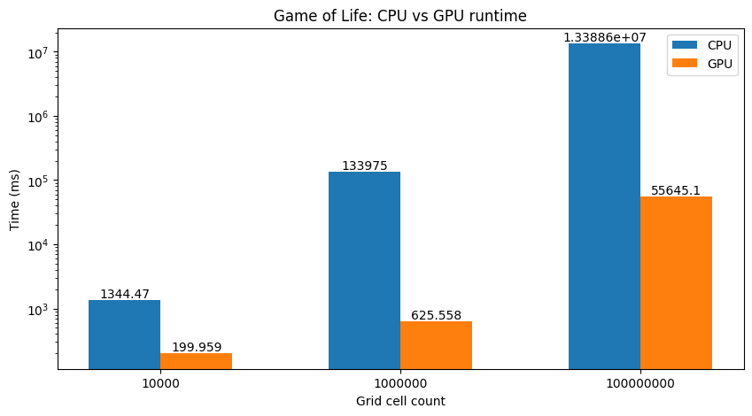

# game-of-life

This project was intended to introduce me to CUDA programming. I have implemented Conway's Game of Life for both the CPU and GPU,  using SFML to provide a GUI. 

# Requirements 

- a CUDA-capable GPU
- SFML for graphics
- CUDA libraries
- CMake
# Instructions to run
- build by running `cmake --build .` in the root of the repo
- to run GUI, run `./run_game`
- to execute the speed test, run `./speed_test`
- execute tests by running `ctest` in root of directory

# CPU vs GPU comparison

This is not a fair comparison between CPU and GPU because there are many optimisations one could introduce to my CPU implemention (e.g. multithreading). However, the 200x run time difference was useful in demonstrating to me the power of a GPU for embarassingly-parallel problems. 

